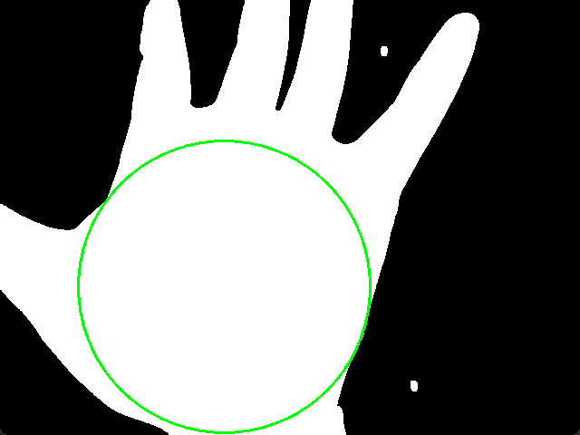
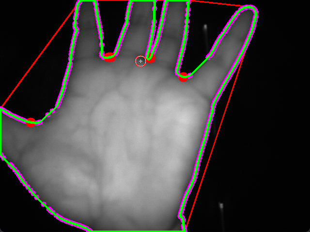
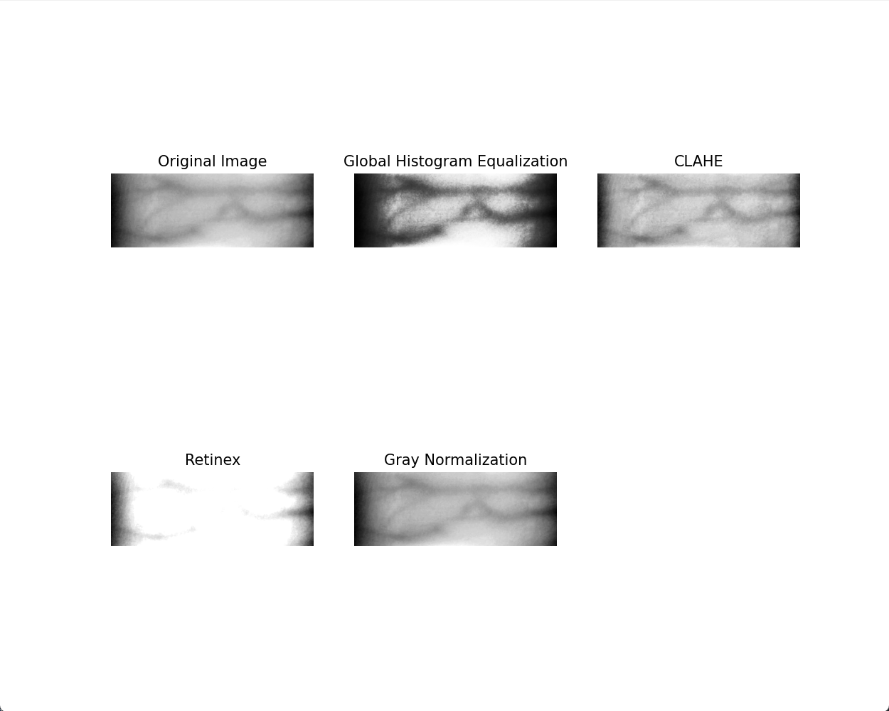
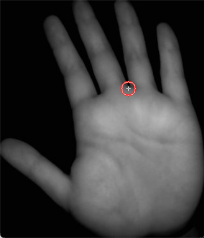

# Finger-Vein-Recognition
A project uses opencv-python and machine leaning to recognition and classify vein of different fingers.

## 方案设计
### 静脉图像采集 略
### 静脉图像预处理
涵盖手指/手掌轮廓分割、手指/手掌感兴趣区域（ROI）截取、静脉纹路增强等环节。轮廓分割是稳定截取 ROI 的关键，要通过前背景分割、剔除小区域、形状对齐等步骤实现；ROI 截取旨在去除无关背景区域，提高特征提取准确率；静脉纹路增强则采取限制对比度自适应直方图均衡化（CLAHE）方法，改善图像质量，增强静脉的特征，便于后续处理。

预处理方案设计：

#### 掌静脉图像预处理
1. 数据聚合
在采集到的数据集中，掌静脉图像样本分散在 PV1、PV2 和 PPPV 文件夹下，所以我们首先需要将同类的数据集聚合起来方便后续处理。对于本课题的研究，我们聚焦于运用生物识别技术去分辨独属于一个人的特征。所以，对采集的样本中包含来自一个人的左手、右手的情况，我们也要选择聚合成一类，而不特地的去区分一个人的“左手”和“右手”。在聚合完成后，我们将得到共10类样本，分别来自10个实验者。每类包含30张采集图像。

2. 提取手掌轮廓
对于每个采集到的图像，手掌可能位于图像的左侧、正中央、右侧……它可能出现在任意一个地方，这是不利于我们的进行后续的处理的。我们希望能够图像能包含手掌的轮廓而不包含其他没用的信息，这样方便我们后续进行其他的处理以及算法设计。这就需要我们提取出手掌的轮廓，并裁切出恰好包含手掌轮廓的图像统一保存起来以便后续使用。

3. 提取掌静脉的感兴趣区域（ROI）
仅仅提取出手掌的轮廓信息是不够的，对于静脉识别技术我们最好能只聚焦在静脉的纹理信息上，因此我们需要提取出掌心周围的一块区域，使得手指的形状、长短、纹路不参与到后续的特征提取步骤，确保提取到的特征是属于掌静脉的。由于每个实验者采集样本过程中并非保持同样的旋转角度以及手掌倾斜程度，因此在获得roi的过程中需要根据手指与手掌的交点，掌心的质心等图像特征对Roi进行旋转矫正。最后保存得到初步的样本。

4. 静脉纹理增强
在提取ROI到深度特征提取还有一个不可或缺的环节——静脉纹理增强。做静脉纹理增强的理由主要有两点：一、提升图像质量。在实际获取静脉图像时，成像机理、相机参数、光照变化以及手的移动和旋转等多种因素，会导致图像出现噪声、模糊、光照不均等问题。这些质量不佳的图像会极大地干扰后续分析和处理。通过静脉纹理增强，能够有效改善这些问题，让图像更清晰，为后续工作奠定良好基础。比如在昏暗环境下采集的静脉图像，可能因光照不均导致部分纹理难以识别，经过纹理增强处理后，原本模糊的区域变得清晰可辨。二、突出关键信息。静脉纹路是静脉图像用于身份识别等任务的最关键特征信息。图像增强作为基本的图像预处理手段，能够针对给定图像，突出其中的重要信息，削弱或去除无用及干扰信息。这样增强后的图像可以使静脉纹理特征更加明显，有助于更准确地进行特征提取和匹配等后续操作，进而提高静脉识别的准确性和可靠性。

### 静脉特征提取
人眼在经过一定的训练之后，可以分辨出不同的静脉纹理的不同从而分辨出不同的人。这个过程就是人脑对特征进行提取、记忆、分辨的过程。而机器并不具备人脑这样的“意识”，因此在过去，人们会使用一些总结出来的先验知识和专业经验来人工设计提取特征的规则和算法。但设计的特征可能无法全面、准确地捕捉到图像中的关键信息。而近年来随着神经网络的发展，诸如卷积神经网络等算法对于图像拥有的强大的自学习能力。尤其是深度神经网络，它能通过大量数据的训练，自动从原始图像数据中学习到有效的特征表示，有些是人难以察觉到的高级的抽象的特征。因此，本课题使用深度神经网络进行特征提取，以在静脉图像分类的过程中取得最好的成绩。

### 静脉特征识别、匹配
对于本课题的研究内容，结合现实生活场景的实际应用，笔者发现基于静脉识别的支付技术在商店、便利店等地方已经初步推广开来。考虑到大规模推广的需要，笔者在经过调研后决定使用MobileNetv3-Small模型。MobileNetv3-Small模型是谷歌团队开发的轻量级卷积神经网络，适用于对模型大小和运行速度极为敏感，计算资源受限更为严重的移动或嵌入式设备场景，能在有限资源下快速执行推理任务。用静脉数据对深度模型训练后，该模型具有静脉特征提取能力。在使用训练好的模型提前到每个样本的特征后，还需计算同类静脉的深度特征的相似度和以及该类与其他不同类静脉特征的相似度。MobileNetv3-Small的线性层倒数第二层形状为(x, 576)，其中x取决于输入的样本的批处理数量，576是特征的维度。也就是说，MobileNetv3-Small输出的特征维度还是比较大的，因此对于这样的高维度的稀疏特征向量，我们选用余弦距离作为相似度的度量标准。我们将选定某一个手指（或手掌）的某一个样本（静脉图片），计算该样本的深度特征与其所有同类手指（或手掌）图像的深度特征的相似度和该样本的深度特征与其所有不同类（来自不同的手指或手掌）的相似度，绘制相似度曲线。

#### 指静脉图像预处理
关于指静脉图像预处理，不少过程与掌静脉图像预处理相似，以下便不再赘述，仅讨论指静脉与掌静脉图像预处理的一些不同之处。在轮廓提取、纹理增强、深度特征提取等方面，二者逻辑相似，可复用同样的模块完成。主要的不同之处集中在感兴趣区域（Roi）的提取上。在掌静脉采集的过程中，样本采集者手掌的角度可能各异，最极端的情况，同一个样本采集者每一次采集的角度都是相差比较大的。这就需要我们进行姿态矫正，使得样本图像在角度上具有一定的一致性。